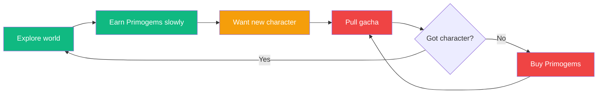

# PlaySmart — Phase 3+ Enhancement Brief

> **For Claude Code.** Read `CLAUDE.md` and `docs/RUBRIC.md` first.
> Do NOT implement any of this until Phase 2 scoring engine tests all pass.
> These are additive changes — do not redesign existing components.
> The current GameCard layout (header, time box, Benefits/Risks/Full Scores tabs)
> stays exactly as-is. These enhancements add to it.
>
> **CRITICAL: The RIS and BDS formulas in RUBRIC.md are unchanged.**
> Nothing in this document modifies the scoring engine or time recommendation logic.
> All existing test fixtures (Zelda 0.045, Genshin 0.66, Minecraft 0.14, etc.)
> must continue to pass as-is.

---

## 1. Dark Pattern Warning Pills (add to Risks tab)

### What
Below the existing four risk meters (Dopamine Manipulation, Monetization Pressure,
Social Risk, Content) and the "What to watch for" box on the Risks tab, add a new
section: **"Detected Tactics"**.

Show colored pills — similar in style to the genre pills in the header — that name
the specific manipulation tactics found in this game. Each pill is tappable/expandable
and shows a one-sentence plain-language explanation written by the reviewer.

### The 12 dark patterns to track

| ID | Label for pill | Description (shown on expand) |
|----|---------------|-------------------------------|
| DP01 | Gateway Purchase | Low-cost starter pack normalizes spending before expensive offers appear |
| DP02 | Confirm-Shaming | Guilting language on decline buttons ("Are you sure you don't want to be cool?") |
| DP03 | False Scarcity | Fake countdown timers or "limited stock" on unlimited digital goods |
| DP04 | Currency Obfuscation | Real money converted to gems/crystals/coins, reducing spending awareness |
| DP05 | Parasocial Prompts | In-game character the child has bonded with asks them to buy things |
| DP06 | Streak Punishment | Streak mechanics that punish missed days rather than just rewarding attendance |
| DP07 | Artificial Energy | Stamina/energy system that refills on timer or purchase |
| DP08 | Social Obligation | Progress requires friends (gift exchanges, raid parties, co-op gates) |
| DP09 | Loot Box / Gacha | Random-chance paid rewards with undisclosed or poor odds |
| DP10 | Pay-to-Skip | Paywalled shortcuts past intentionally tedious progression |
| DP11 | Notification Spam | Aggressive re-engagement push notifications |
| DP12 | FOMO Events | Time-limited content/events designed to create urgency |

### Pill styling
- If no dark patterns detected: show a green "✓ No manipulative tactics detected" message
- Low severity: grey pill, muted text
- Medium severity: amber/orange pill
- High severity: red pill
- Pill text is just the label (e.g., "Currency Obfuscation"). Tap to expand description.

### Two patterns get extra prominence
When DP04 (Currency Obfuscation) is detected, also add a banner to the **Cost
Transparency** section at the bottom of the card:
"💱 This game uses virtual currency — real costs may not be obvious to children"
Plus the exchange rate if available (e.g., "100 Primogems ≈ $1.99").

When DP05 (Parasocial Prompts) is detected, show a standalone badge:
"🧸 Characters in this game directly ask players to make purchases"

### Schema
Create new table `dark_patterns` (Drizzle schema):
```typescript
export const darkPatterns = pgTable('dark_patterns', {
  id: serial('id').primaryKey(),
  reviewId: integer('review_id').notNull().references(() => reviews.id),
  patternId: varchar('pattern_id', { length: 4 }).notNull(),  // DP01-DP12
  severity: varchar('severity', { length: 6 }).notNull(),      // low, medium, high
  description: text('description'),  // reviewer's game-specific note
  createdAt: timestamp('created_at').defaultNow(),
});
```

Add to `reviews` table:
```typescript
usesVirtualCurrency: boolean('uses_virtual_currency').default(false),
virtualCurrencyName: varchar('virtual_currency_name', { length: 50 }),
virtualCurrencyRate: text('virtual_currency_rate'),  // "100 = $1.99"
```

### Component
Create `DarkPatternPills.tsx`. Accepts an array of dark patterns and renders them.
Add to the Risks tab below the existing risk meters and "What to watch for" box.

### Seed data
Add dark pattern flags for existing reviewed games:
- **Zelda TotK:** No dark patterns. Show "✓ No manipulative tactics detected"
- **Genshin Impact:** DP04 (high), DP06 (medium), DP07 (medium), DP09 (high),
  DP10 (low), DP12 (high). Virtual currency: "Primogems", rate: "160 ≈ $2.99"
- **Minecraft (no marketplace):** No dark patterns
- **Split Fiction:** No dark patterns
- **GTA Online:** DP04 (high), DP03 (medium), DP10 (high), DP12 (medium).
  Virtual currency: "Shark Cards / GTA$", rate: "$1,250,000 GTA$ ≈ $19.99"

---

## 2. Executive Summary Line (add to card header area)

### What
Add a single plain-language sentence between the genre pills / Metacritic score
and the green time recommendation box. This is the "what you need to know in
5 seconds" line.

Examples:
- Zelda: "High-benefit exploration game with minimal manipulation design."
- Genshin: "Beautiful world with genuine learning value, but aggressive gacha monetization."
- Minecraft: "Exceptional creativity tool — set your own time limits, the game won't."
- GTA Online: "Not designed for children. High manipulation, high spending pressure."

### Schema
Add to `game_scores` table:
```typescript
executiveSummary: text('executive_summary'),
```

Populated manually by reviewers (store it in the review, copy to game_scores on
approval). If NULL, don't render anything — no empty space.

### Display
Render as a single line of slightly smaller, muted text. Not a box, not a card,
not a callout — just a subtitle line. Keep it subtle.

---

## 3. Radar Chart + R5/R6 (DISPLAY ONLY — does NOT change the scoring engine)

### What
Add a 5-axis radar/spider chart to the game detail page showing the shape of the
game's risk profile at a glance. Place it on the **Full Scores** tab in a new
"Risk Profile Shape" section above the existing detailed risk score bars.

The existing risk meters on the Risks tab are unchanged.

### The 5 axes
1. **Addictive Design** — existing R1 normalized score (already computed)
2. **Monetization** — existing R2 normalized score (already computed)
3. **Social/Emotional** — existing R3 normalized score (already computed)
4. **Accessibility Risk** (NEW — R5) — how frictionlessly a child can reach the
   game unsupervised: cross-platform, instant load, mobile-optimized, no login barrier
5. **Endless Design** (NEW — R6) — infinite/unbounded gameplay, no natural stopping
   points, no "game over" state, no chapter/level structure

### IMPORTANT: Display only
> R5 and R6 are **display-only dimensions** — like R4 (Content Risk), they do NOT
> feed into the RIS formula or the time recommendation. The RIS formula remains:
> `RIS = (R1_norm × 0.45) + (R2_norm × 0.30) + (R3_norm × 0.25)`
>
> R5 and R6 appear on the radar chart and on the Full Scores tab to give parents
> additional context, but they do not change any computed scores or time outputs.
> No existing tests need updating.
>
> In a future version (v0.2+), after validating these new dimensions with parents
> and reviewers, we may integrate them into the RIS formula with updated weights.
> That is out of scope for this brief.

### Why these two dimensions matter even as display-only
- **Accessibility Risk:** A phone game with 2-second load bypasses cognitive pauses
  that might interrupt compulsive play. Console-only games have natural friction
  (TV, controller, boot time). Parents should see this context even if it doesn't
  affect the time recommendation yet.
- **Endless Design:** Minecraft scores low on R1 (no variable rewards, no streaks)
  but has literally infinite gameplay with zero stopping cues. Parents need to know
  "this game has no end" even when the addictive design score is low.

### Schema
Add to `reviews` table:
```typescript
// R5: Accessibility risk (0-3 each, max 12) — DISPLAY ONLY, not in RIS
r5CrossPlatform: integer('r5_cross_platform'),      // 0=single platform, 3=everywhere inc. mobile
r5LoadTime: integer('r5_load_time'),                  // 0=slow boot, 3=instant/no load
r5MobileOptimized: integer('r5_mobile_optimized'),    // 0=not mobile, 3=mobile-first design
r5LoginBarrier: integer('r5_login_barrier'),           // 0=complex setup needed, 3=tap and play

// R6: Endless/world design risk (0-3 each, max 12) — DISPLAY ONLY, not in RIS
r6InfiniteGameplay: integer('r6_infinite_gameplay'),   // 0=finite game, 3=literally infinite
r6NoStoppingPoints: integer('r6_no_stopping_points'),  // 0=clear save/break points, 3=no cues to stop
r6NoGameOver: integer('r6_no_game_over'),              // 0=fail states exist, 3=cannot lose/end
r6NoChapterStructure: integer('r6_no_chapters'),       // 0=linear chapters/levels, 3=no structure
```

Add to `game_scores` table:
```typescript
accessibilityRisk: real('accessibility_risk'),   // R5 normalized 0-1, display only
endlessDesignRisk: real('endless_design_risk'),   // R6 normalized 0-1, display only
```

### Seed values for existing games

| Game | R5 sub-scores (cross/load/mobile/login) | R5 total | R6 sub-scores (infinite/stop/over/chapters) | R6 total |
|------|----------------------------------------|----------|---------------------------------------------|----------|
| Zelda TotK | 0/0/0/2 | 2/12 | 2/1/1/2 | 6/12 |
| Genshin Impact | 3/3/3/1 | 10/12 | 2/2/2/2 | 8/12 |
| Split Fiction | 1/0/0/1 | 2/12 | 0/0/0/3 | 3/12 |
| Minecraft (no marketplace) | 2/1/1/0 | 4/12 | 3/3/3/2 | 11/12 |
| GTA Online | 2/2/2/2 | 8/12 | 3/3/2/2 | 10/12 |

### Component
Create `RiskRadarChart.tsx` using Recharts `<RadarChart>`.
- 5 axes, each scaled 0–1
- For R1/R2/R3: use the existing normalized values from `game_scores`
- For R5/R6: normalize as raw_score / 12
- Show a light grey "safe baseline" polygon at 0.2 on all axes for reference
- Tooltip on each axis showing the dimension name and score

### Display placement
- **Full Scores tab:** Add as a new section "Risk Profile Shape" above the
  existing "RISK SCORES (0–3)" detail section. The chart visualizes the same
  data shown in the bars below it, plus R5 and R6.
- **Full Scores tab:** Add R5 and R6 as two new subsections below the existing
  R1–R4 bar charts, using the same visual style (horizontal bars, 0–3 scale,
  with labels for each sub-item).

---

## 4. Regulatory Compliance Badges (add below Cost section)

### What
A row of small badges showing whether the game complies with child-safety
regulations. Add below the existing cost transparency section at the bottom
of the card.

### Badges to track
| Code | Label | What it means |
|------|-------|---------------|
| DSA | EU Digital Services Act | Meets transparency requirements for minors |
| GDPR-K | GDPR Children | Proper consent/age-gating for under-16 |
| ODDS | Loot Box Odds | Publishes drop rates (required in CN/JP/KR) |

### Display
- Grey badge = not yet assessed (default state — most games will start here)
- Green badge = compliant
- Red badge = non-compliant
- Tappable for a one-sentence explanation

### Schema
```typescript
export const complianceStatus = pgTable('compliance_status', {
  id: serial('id').primaryKey(),
  gameId: integer('game_id').notNull().references(() => games.id),
  regulation: varchar('regulation', { length: 10 }).notNull(),
  status: varchar('status', { length: 15 }).notNull(),  // compliant, non_compliant, not_assessed
  notes: text('notes'),
  assessedAt: timestamp('assessed_at'),
  createdAt: timestamp('created_at').defaultNow(),
}, (table) => ({
  unique: uniqueIndex('compliance_unique').on(table.gameId, table.regulation),
}));
```

### Priority
Lowest priority. Add the schema and component, but seed data can come later —
compliance assessment requires external research per game.

---

## 5. Engagement Loop Diagram (Tier 3 expert reviews only)

### What
For games that receive a Tier 3 expert deep review, add a flow diagram to the
game detail page showing the core engagement loop: where organic gameplay happens,
where artificial friction is injected, and where pay-to-skip is offered.

### Display
Render as a Mermaid diagram on the Risks tab, below the "What to watch for" box
and dark pattern pills (if present). Only show when available — most games won't
have this.

Color-code nodes: green = organic gameplay, amber = artificial friction point,
red = monetization injection point.

Example Mermaid source for Genshin Impact:


### Schema
Add to `reviews` table:
```typescript
engagementLoopDiagram: text('engagement_loop_diagram'),  // Mermaid source, NULL for Tier 1/2
reviewTier: integer('review_tier').default(1),             // 1, 2, or 3
```

### Component
Create `EngagementLoopDiagram.tsx`. Only renders when `reviewTier === 3` and
`engagementLoopDiagram` is not null. Use a Mermaid rendering library (e.g.,
`mermaid` npm package) or server-side render to SVG.

### Priority
Lowest build priority — only relevant once Tier 3 reviews exist.

---

## Implementation Order

All of these are safe to implement independently. None modify the scoring engine.

1. **Dark Pattern Pills** — highest user-visible impact, adds the most parent value
2. **Executive Summary Line** — tiny change, big readability improvement
3. **Radar Chart + R5/R6** — adds visual depth, requires new schema columns but
   no formula changes
4. **Compliance Badges** — schema + component now, data later
5. **Engagement Loop Diagram** — build last, Tier 3 only

### What NOT to change
- The RIS formula: `RIS = (R1_norm × 0.45) + (R2_norm × 0.30) + (R3_norm × 0.25)`
- The BDS formula: `BDS = (B1_norm × 0.50) + (B2_norm × 0.30) + (B3_norm × 0.20)`
- The time recommendation tiers and thresholds
- The benefit modifier logic (BDS ≥ 0.60 extends, BDS < 0.20 drops)
- Any existing test fixture values
- The existing Risks tab layout (meters + narrative boxes)
- The existing Benefits tab layout (pills + bars + narrative)
- The existing Full Scores tab layout (add to it, don't rearrange it)
